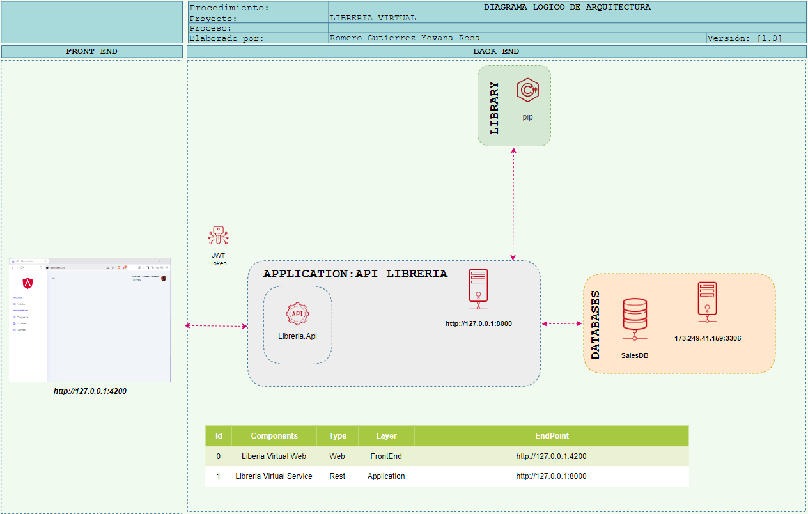
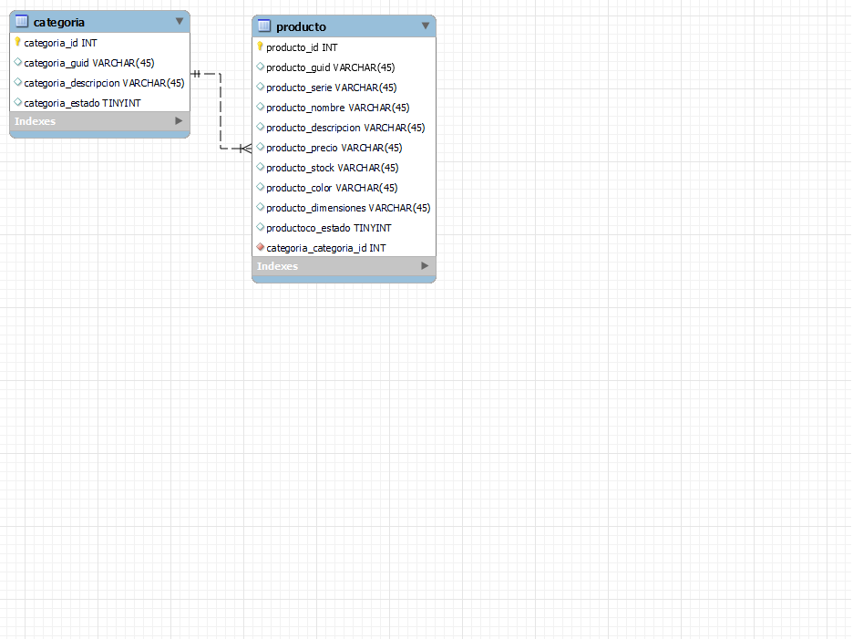
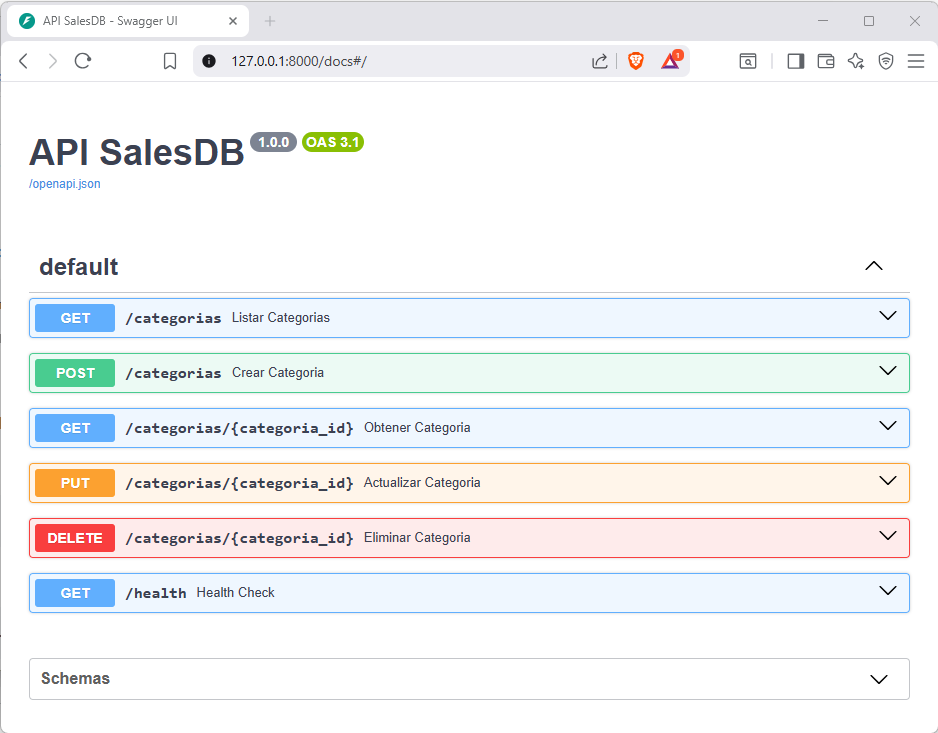
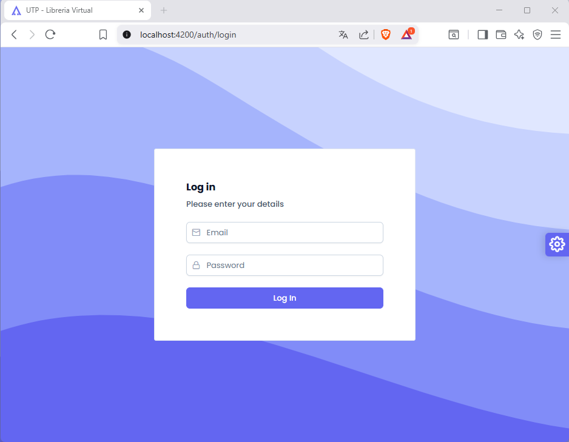
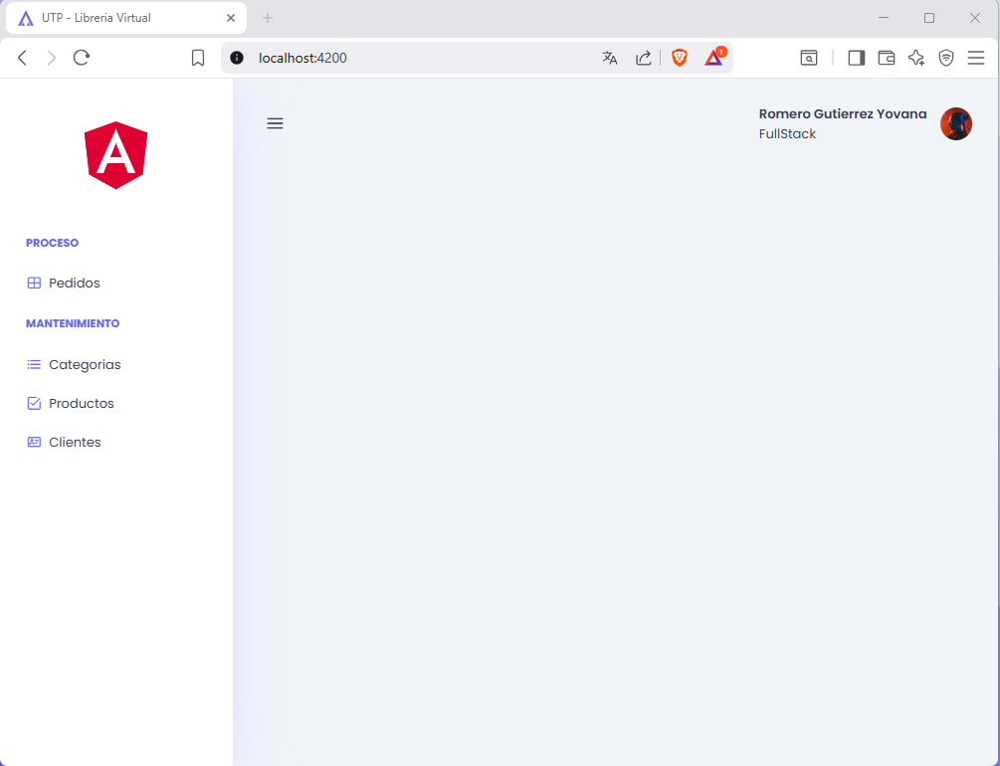

# Libreria Virtual 1.0.0


## 💪 Acerca del grupo
- Romero Gutierrez Yovana Rosa 🌸
- De la Cruz Chaveta Julio
- Rojas Leon Kelvin Marco Antonio 
- Davila Sanchez Victor Daniel
- Garcia Valderrama Augusto Manuel

## 💡 Funcionalidades del proyecto
- `Mantenimiento de Categoria` ✔️: 
  
| Field                     | Type     | Description      |
| :------------------------ | :------- | :--------------- |
| `categoria_id`            | `integer` | **Required**. primary key  |
| `categoria_nombre`        | `string` | nombre de categoria |
| `categoria_descripcion`   | `string` | descripcion de categoria |
  

 Permite mostrar la información de las categorías, así como las operaciones:
    - Buscar categoría
    - Registrar categoría
    - Modificar categoría
    - Eliminar categoría 

- `Mantenimiento de Productos` ✔️: 
  
| Field                     | Type     | Description      |
| :------------------------ | :------- | :--------------- |
| `producto_id`             | `string` | **Required**. primary key  |
| `producto_nombre`         | `string` | nombre de producto         |
| `producto_descripcion`    | `string` | descripcion de producto    |
| `producto_precio`         | `decimal` | precio de producto        |
| `producto_stock`          | `integer` | stock de producto         |
| `categoria_id`            | `integer` | **Required**. foreign key categoria     |
| `producto_color`          | `string` | color de producto          |
| `producto_dimensiones`    | `string` | dimensiones de producto    |

Permite mostrar la información de los productos, así como las operaciones:
  - Buscar Producto
  - Registrar Producto
  - Modificar Producto
  - Eliminar Producto 
  - Asignar productos a categorías


## 🛠️ Especificaciones Técnicas
- [x] BackEnd: [Python 3.13.x](https://www.python.org/downloads/release/python-3135/)  
- [x] FrontEnd: [Node 20.19.5 (LTS)](https://nodejs.org/en/download)   
- [x] FrontEnd: [Angular CLI 20.x](https://angular.dev/installation)  

## 📐 Diagrama de Arquitectura
.

## 📐 Modelo Entidad Relacion (DataBase)
.


## 🚀 Arrancar Proyecto
### Clonar repositorio
considere siempre usar la rama: **master**

```bash
git clone https://github.com/YovanaRomero/UTP-LP-LIBRERIA.git
```
### BackEnd
ubiquese desde su terminal en la carpeta del proyecto `backend`

```shell
cd backend
```

#### Purgar dependencias 

```shell
pip cache purge
```

#### Instalar dependencias 

```shell
pip install -r requirements.txt
```
#### Ejecutar desde la terminal
```shell
uvicorn app.main:app --reload
python -m uvicorn app.main:app --reload
```
#### Ejecutar desde Visual Code
Configurar un launch.json
Ve al panel "Run and Debug" (icono de play y bug en la barra lateral).

#### 📷 Screenshot
> Nota: puede verifique ingresando a swagger [http://localhost:8000/docs](http://localhost:8000/docs)

.


### FrontEnd 🌐
ubiquese desde su terminal en la carpeta del proyecto `frontend`
```shell
cd frontend
```
#### Instalar dependencias

```shell
npm install
```

#### Ejecutar desde la terminal 

```shell
ng serve -o
```

#### 📷 Screenshot
> Nota: puede verifique ingresando a [http://localhost:4200](http://localhost:4200)

.
.


## License

[MIT](https://choosealicense.com/licenses/mit/)